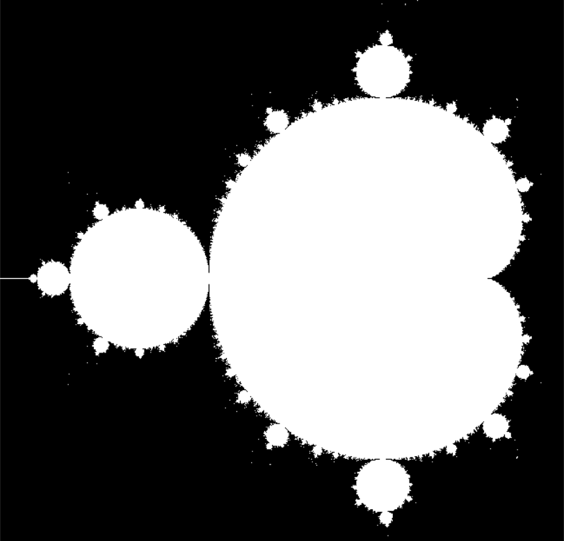

# Show MandelBrot Fractal
## chapel-clojure-app

 This program is for linux (or Mac) 
 
 In Windows, This program will occure JVM error: A Java Exception has occured.

  
  
## Installation

    $ git clone https://github.com/elect000/chapel-clojure-apps ccapps 
    $ cd ccapps
1. from leiningen

        $ lein run
2. from jar

        $ lein uberjar
        $ cd target 
        $ java -jar chapel-clojure-app-0.1.0-standalone.jar 
## Usage

Click : move

Up/Down arrow-key : zoom in/out

## Options
   If you want to get pbm-image, you can use this executable file.

   The Image

   - from --xstart to --xstart + --size 
    
   - from --ystart to --ystart + --size
    
   - n * n pixels 
    
   - iterate --maxIter
    
   - limit --imit
        
    $ cd resources
    $ ./my-mandelbrot-chapel --n=600 --xstart=-1.5 --ystart=-1.0 --size=2.0 --maxIter=150 > image.pbm

### Bugs

 In Windows This programi will brake ... I don't know how to fix it.

## License

Copyright © 2017 FIXME

Distributed under the Eclipse Public License either version 1.0 or (at
your option) any later version.
